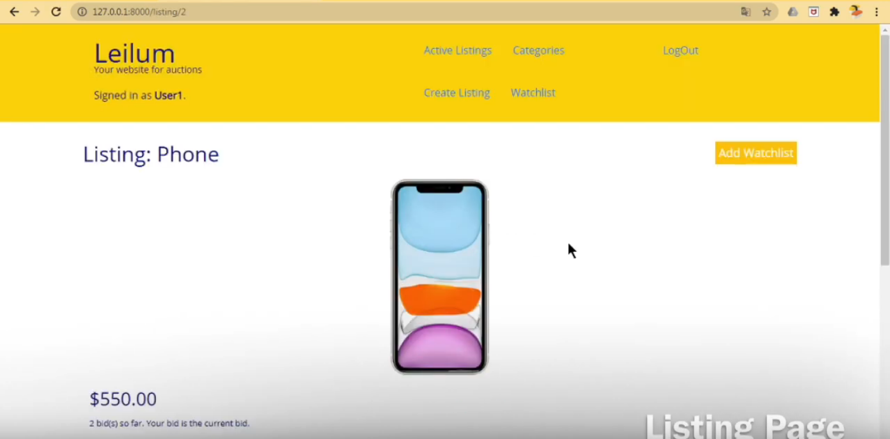

# Commerce
## An eBay-like e-commerce auction site
Project 2 - [CS50’s Web Programming with Python and JavaScript](https://cs50.harvard.edu/web/2020/)

Implemented using the Django framework.

For a full demo, see [this video](https://www.youtube.com/watch?v=wes97I9OEMI&list=PL63wdUW0APKvFys2It2Ubgs6DslKpblW8).

### Specification

- Models: Your application should have at least three models in addition to the User model: one for auction listings, one for bids, and one for comments made on auction listings.
  
- Create Listing: Users should be able to visit a page to create a new listing.

- Active Listings Page: The default route of your web application should let users view all of the currently active auction listings. 

- Listing Page: Clicking on a listing should take users to a page specific to that listing. On that page, users should be able to view all details about the listing, including the current price for the listing.

- Watchlist: Users who are signed in should be able to visit a Watchlist page, which should display all of the listings that a user has added to their watchlist. Clicking on any of those listings should take the user to that listing’s page.

- Categories: Users should be able to visit a page that displays a list of all listing categories. Clicking on the name of any category should take the user to a page that displays all of the active listings in that category.

- Django Admin Interface: Via the Django admin interface, a site administrator should be able to view, add, edit, and delete any listings, comments, and bids made on the site.
